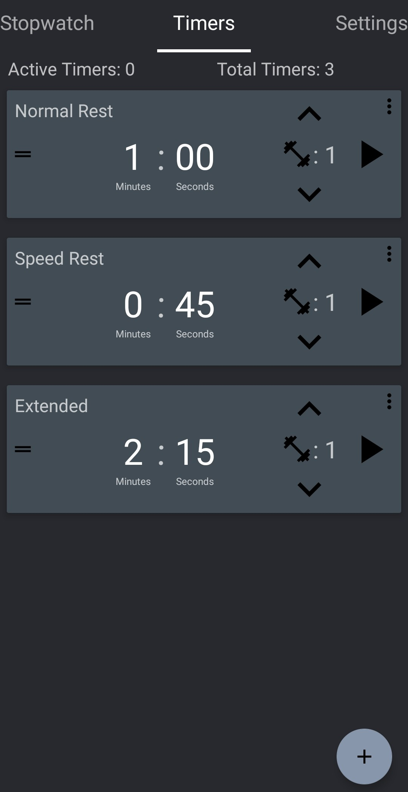
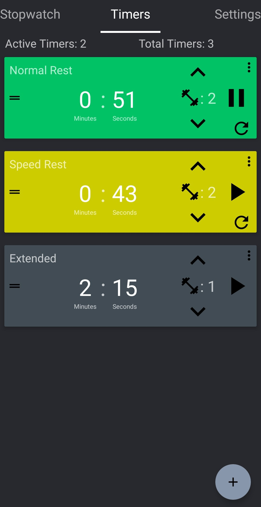
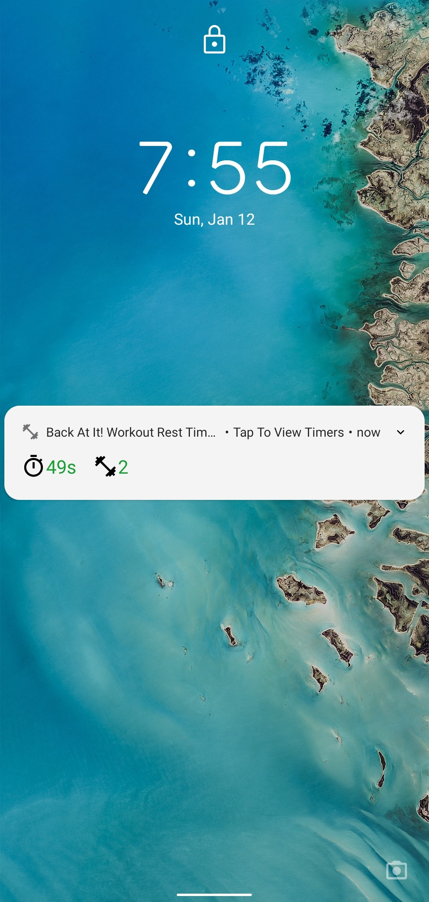
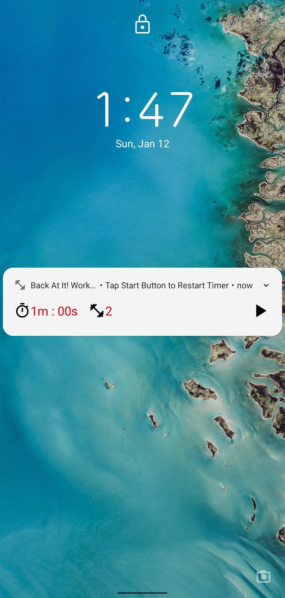

# Back At It Timer

The following app is a timer app that also helps keep track of the current set that you are on for a workout.
This app utilizes a foreground service, so that the timer can always display the time remaining before your next set and allows for 
resetting the timer via a notification icon press, even from the lock screen of the device.
Currently the project is being re-written in Kotlin and with Android Jetpack, as it was originally written in Java. 

## Building the App

### Disclaimer 

Firebase is utilized in this project, which requires a google-services.json file to run. API keys and sensitive information have been removed from the file, so functionality of Firebase is limited. 

### Pre-requisites

* Android Studio 3.5+
* Android SDK 29
* AndroidX

### Clone the repo:

`git clone https://github.com/garypan51/BackAtIt.git`

### Android Studio (Recommended version 3.5)

* From the Android Studio Launcher select `Open an existing Android Project` and navigate to the root directory of your project.
* Click 'OK' to open the the project in Android Studio.
* A Gradle sync should start, if not then force gradle sync by re-building project `Build -> Rebuild Project`

## Running the App

Connect an Android device to your development machine if you wish to run the app on a physical device.

Create an Android Emulator if one doesn't already exist to run the app on a emulator.

* Select `Run -> Run 'app'` from the menu bar
* Select the device/emulator you wish to run the app on and click 'OK'

## Screenshots 

    
    &nbsp;
    
    &nbsp;
    
    &nbsp;
    

## Estimated RoadMap

The following are a list of items that should be worked on sorted by the order of priority and/or importance.
1. UNIT TESTS!!! (Q1 2020)
    * Make sure that every viewModel class has it's own unit tests.
2. Architecture Refactor (Q1 - Q2 2020)
    * Add Navigation library.
    * Migrate to Gradle Kotlin.
    * Better viewModel and structure.
    * Add dagger for dependency injection for service, viewModels, and fragments.
3. Add More Features and UI Redesign (Q1 - Q3 2020)
    * Rework design to be user friendly.
        * Remove timer logic from Recycler view of timers. Change flow so when users tap on timer, they are redirected
        to another screen where they can actually interact with the timer they selected.
        * Add Settings screen so that user can change themes and other timer/notification related setting 
        * Change colors of notification layout for dark mode, so icons are visible.
        * Remove ability to set hours for a timer. Use case very minimal when it comes to timing rest time in between sets.
        * Standardize how the time should be shown on the timers (i.e always show the minutes or not - "0m : 20s" vs "20s").
    * Finalize all changes and create comps on Adobe XD before starting any further development.
    * Add Stopwatch functionality.
    * Add light and dark themes.

## Notice 

The Following software/libraries were utilized.

* Android Open Source Project
* Kotlin
* Android JetPack
    * ViewModel
    * LiveData
    * Room Persistence Library
* Coroutines
* Firebase
* Crashlytics
